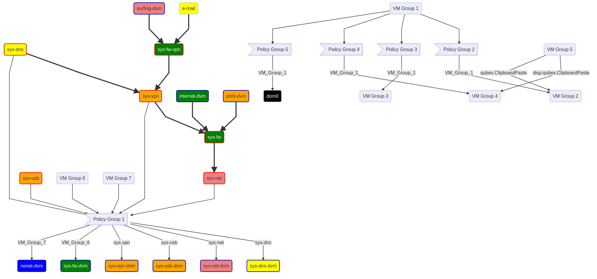

# qvm-ls-mermaid

Generate [mermaid-js](https://mermaid-js.github.io/) network and [RPC](https://www.qubes-os.org/doc/rpc-policy/) graphs for your [Qubes OS](https://www.qubes-os.org/) system and display them inside a [Qubes OS](https://www.qubes-os.org/) VM.

See the architecture of an entire Qubes OS system at a glance!

The output is a full html page displayed in your browser. For static images you can convert that with e.g. [mermaid-cli](https://github.com/mermaid-js/mermaid-cli).

## Example

A full Qubes OS installation including _all_ configured RPC policies:  

This example was generated via `qvm-ls-mermaid -nR`.

### What do I see here?

- The thick arrows represent network connections, the thin arrows RPC policy relations.
- A blue VM border indicates a template VM, a red border indicates a disposable VM and a neutral border a regular AppVM.
- VMs are colored according to their security label. VM and Policy Groups have no special color or border.
- VM Groups represent multiple VMs, Policy Groups multiple RPC policies. These nodes can be clicked to show the contained VMs/policies when the `-D` option was used (not here).
- Policy Group nodes have a special form to discern them from VMs. If they only represent a single policy, they are removed and the policy name can be found at the edge (e.g. between VM Group 5,4 and 2).
- "disp:" indicates that the RPC policy is only valid for disposable VMs of the target node (VM Group 4 contains many template VMs).
- VMs without network or RPC policy relations were removed from the graph thanks to the `-n` option.
- This is a graph generated from a real-world Qubes OS system with more than 50 VMs, but [it easily fits on your 2k+ screen](https://raw.githubusercontent.com/3hhh/qvm-ls-mermaid/master/examples/1.png)!

## Features

- VMs are displayed as nodes in a directed graph, connected according to their network and [RPC](https://www.qubes-os.org/doc/rpc-policy/) relations
- automatic node placement
- text output (useful for version control)
- usage of web standards:
  - arbitrary customization
  - arbitrary zoom
- input filtering via `grep`, `sed`, ...
- clickable nodes

## Installation

1. Download [blib](https://github.com/3hhh/blib), copy it to dom0 and install it according to [its instructions](https://github.com/3hhh/blib#installation).
2. In dom0, install the [networkx library](https://networkx.org/) via `sudo qubes-dom0-update python3-networkx-core python3-networkx-drawing`. If you skip this step, the RPC graph (`-R` option) cannot be generated.
3. Download this repository with `git clone https://github.com/3hhh/qidle.git` or your browser and copy it to dom0.
4. Move the repository to a directory of your liking.
5. Symlink the `qvm-ls-mermaid` binary into your dom0 `PATH` for convenience, e.g. to `/usr/bin/`.

### A word of caution

It is recommended to apply standard operational security practices during installation such as:

- Github SSL certificate checks
- Check the GPG commit signatures using `git log --pretty="format:%h %G? %GK %aN  %s"`. All of them should be good (G) signatures coming from the same key `(1533 C122 5C1B 41AF C46B 33EB) EB03 A691 DB2F 0833` (assuming you trust that key).
- Code review

You're installing something to dom0 after all.

## Usage

Execute `qvm-ls-mermaid help` on the command-line to obtain an overview of its capabilities.

By default a network graph is generated. Use the `-R` option to also include [RPC](https://www.qubes-os.org/doc/rpc-policy/) relations in the output graph.

## Uninstall

1. Remove all symlinks that you created during the installation.
2. Remove the repository clone from dom0.
3. Uninstall [blib](https://github.com/3hhh/blib) according to [its instructions](https://github.com/3hhh/blib#uninstall).

## Copyright

© 2021 David Hobach
GPLv3

See `LICENSE` for details.
